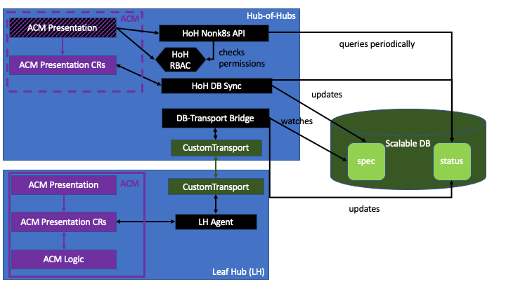

# Hub of Hubs

----

Hub of Hubs provides multi-cluster management at very high scale (10,000 - 1,000,000 clusters).

Hub of Hubs utilizes several standard [RHACM hub clusters](https://access.redhat.com/documentation/en-us/red_hat_advanced_cluster_management_for_kubernetes/2.4/html/about/welcome-to-red-hat-advanced-cluster-management-for-kubernetes#hub-cluster)
to provide cluster-management capabilities, such as applying compliance policies to managed clusters and monitoring
compliance status, or managing application and cluster lifecycle, while addressing the scale and performance
requirements of edge use cases.

Our measurements showed that Hub of Hubs is able to manage one million clusters with hundreds of
policies and/or applications applied to each cluster.

Go to the [Contributing guide](CONTRIBUTING.md) to learn how to get involved.

----

## Getting Started

## Demo

The [demo script](demos/basic.md).

## Repositories

### Ansible playbooks to setup PostgreSQL
* [hub-of-hubs-postgresql](https://github.com/open-cluster-management/hub-of-hubs-postgresql)

### Hub-of-Hubs components

* [hub-of-hubs-spec-sync](https://github.com/open-cluster-management/hub-of-hubs-spec-sync)
* [hub-of-hubs-status-sync](https://github.com/open-cluster-management/hub-of-hubs-status-sync)
* [hub-of-hubs-spec-transport-bridge](https://github.com/open-cluster-management/hub-of-hubs-spec-transport-bridge)
* [hub-of-hubs-status-transport-bridge](https://github.com/open-cluster-management/hub-of-hubs-status-transport-bridge)

#### RBAC

* [hub-of-hubs-rbac](https://github.com/open-cluster-management/hub-of-hubs-rbac)

#### Non-Kubernetes REST API

* [hub-of-hubs-nonk8s-api](https://github.com/open-cluster-management/hub-of-hubs-nonk8s-api)

#### UI

* [hub-of-hubs-console](https://github.com/open-cluster-management/hub-of-hubs-console)
* [hub-of-hubs-console-chart](https://github.com/open-cluster-management/hub-of-hubs-console-chart)
* [hub-of-hubs-ui-components](https://github.com/open-cluster-management/hub-of-hubs-ui-components)
* [hub-of-hubs-grc-ui](https://github.com/open-cluster-management/hub-of-hubs-grc-ui)

### Transport options

* [hub-of-hubs-sync-service](https://github.com/open-cluster-management/hub-of-hubs-sync-service)
* [hub-of-hubs-kafka-transport](https://github.com/open-cluster-management/hub-of-hubs-kafka-transport)

### Message Compression

* [hub-of-hubs-message-compression](https://github.com/open-cluster-management/hub-of-hubs-message-compression)

### Hub-of-Hubs-agent components

* [leaf-hub-spec-sync](https://github.com/open-cluster-management/leaf-hub-spec-sync)
* [leaf-hub-status-sync](https://github.com/open-cluster-management/leaf-hub-status-sync)

### Data types definitions

* [hub-of-hubs-crds](https://github.com/open-cluster-management/hub-of-hubs-crds)
* [hub-of-hubs-data-types](https://github.com/open-cluster-management/hub-of-hubs-data-types)

### Custom repositories

* Hub of Hubs
  * https://github.com/vadimeisenbergibm/governance-policy-propagator/tree/no_status_update to prevent updating policy status by governance policy propagator

## Deployment

See [deployment scripts](deploy).

## Development

### Go version

1.17

### Conventions

#### Versioning

We use [the go modules semantic versioning convention](https://blog.golang.org/publishing-go-modules#TOC_3.), the git tags of the form `vMAJOR.MINOR.PATCH`. The major version for this POC is `0`. The depending modules should specify the versions of the hub-of-hubs repositories explicitly, and not use pseudo-verisons (like `v0.0.0-20200610161514-939cead3902c`).

The hub-of-hubs modules should use common versions of the dependencies. See [the list of the dependencies, and the versions to use in the POC](versions.md).

#### Context usage

`Context.Background()` should be defined in the beginning of each "main" method, such as `Reconcile`, or of a method to be called as a go routine,  and then passed to all the called methods. The functions that handle timers/timeouts/cancel events must handle cancelling the context.

References:
* http://p.agnihotry.com/post/understanding_the_context_package_in_golang/
* https://blog.golang.org/context

#### Errors vs logging

All the errors should be wrapped before returning, using `fmt.Errorf("Some description: %w", err)`. The errors should only be logged once in the "main" method, such as `Reconcile` or methods that do not return errors.

References:
* https://www.orsolabs.com/post/go-errors-and-logs/

#### Logging

We use controller-runtime logging and its [Logging guidelines](https://github.com/kubernetes-sigs/controller-runtime/blob/master/TMP-LOGGING.md).

#### Concurrency

We should use go routines where possible. Note that the database concurrency is limited by the maximal number of database connections (about 100). The multiple connections to a database are handled by pgx connection pool.

#### Using controller-runtime Manager

While using [controller-runtime Manager](https://pkg.go.dev/sigs.k8s.io/controller-runtime/pkg/manager) for controllers seems to be an obvious choice, 
using [controller-runtime's Manager](https://pkg.go.dev/sigs.k8s.io/controller-runtime/pkg/manager) for other components (for example for DB synchronizers) 
is not. We try to use [controller-runtime's Manager](https://pkg.go.dev/sigs.k8s.io/controller-runtime/pkg/manager) as much as possible, even for running components that are not controllers.

[controller-runtime's Manager](https://pkg.go.dev/sigs.k8s.io/controller-runtime/pkg/manager) provides the following functionality in addition to managing controllers:

   * Kubernetes client with caching
   * start/stop [Runnables](https://pkg.go.dev/sigs.k8s.io/controller-runtime/pkg/manager#Runnable).
   * signal handling
   * leader election
   * metrics
   * health/ready checks
   * client-side event processing

See [an example of using controller-runtime Manager features](https://github.com/kubernetes-sigs/kubebuilder/blob/master/docs/book/src/cronjob-tutorial/testdata/project/main.go).

#### Running as singletons

All the components are designed to run as singletons (a single active replica), since there is no load balancing between components. We use leader election of [controller-runtime's Manager](https://pkg.go.dev/sigs.k8s.io/controller-runtime/pkg/manager) to implement the singleton pattern.

#### Events

Currently we do not produce events.

#### Metrics

Currently we do not publish any metrics.

#### Health/ready checks

Currently we do not use health/ready checks.

### Build
 
* [Makefile](https://github.com/open-cluster-management/hub-of-hubs-spec-sync/blob/main/Makefile) 
* [Dockerfile](https://github.com/open-cluster-management/hub-of-hubs-spec-sync/blob/main/build/Dockerfile) 
* [build scripts](https://github.com/open-cluster-management/hub-of-hubs-spec-sync/tree/main/build/scripts)

### Formatting

* [GCI](https://github.com/daixiang0/gci) for ordering imports.
* [gofumpt](https://github.com/mvdan/gofumpt) for formatting (a stricter tool than `go fmt`).
* `go fmt`

### Linting

* `go vet`
* [golangci-lint](https://github.com/golangci/golangci-lint), minimal version 1.43.0, the settings file is [.golangci.yaml](https://github.com/open-cluster-management/hub-of-hubs-spec-sync/blob/main/.golangci.yaml).
* [golint](https://github.com/golang/lint)

❗Remember to copy [.golangci.yaml](https://github.com/open-cluster-management/hub-of-hubs-spec-sync/blob/main/.golangci.yaml) into your repo directory before linting.

ℹ️ If you want to specify something as false-positive, use the [//nolint](https://golangci-lint.run/usage/false-positives/) comment.

ℹ️ If you see stale errors from [golangci-lint](https://github.com/golangci/golangci-lint), run `golangci-lint cache clean`.

### Tests

We did not implement any unit/e2e tests for this POC.

### Simulation at high scale

See [simulation at high scale](./simulation.md).
