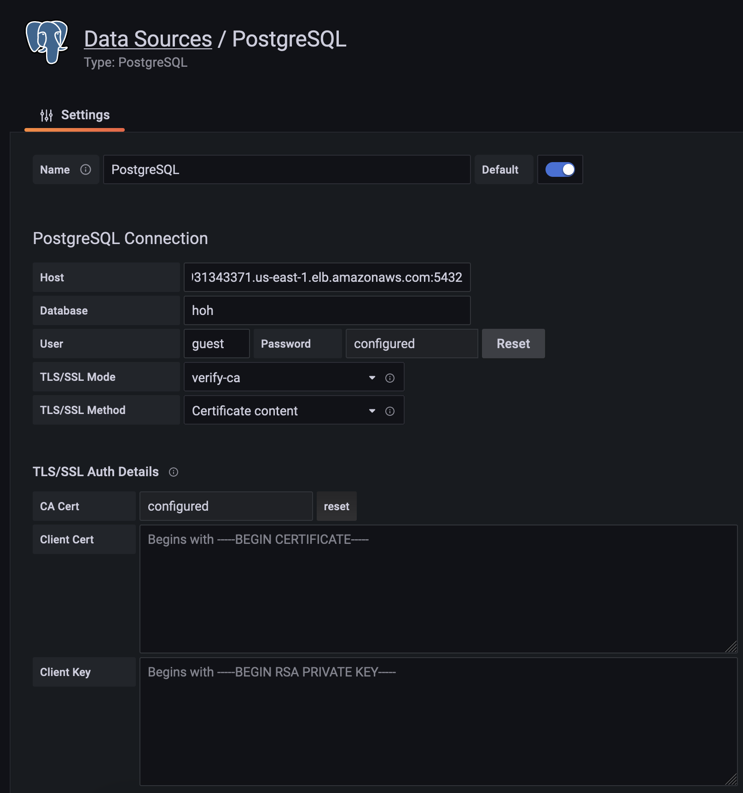

Multicluster global hub depends on the middleware (Kafka, Postgres) and observability platform (grafana) to provide the policy compliance view. Multicluster global hub has build-in Kafka, postgres and grafana, but you still can bring your own Kafka, postgres and grafana. This document focuses on how to bring your own.

## Bring your own Kafka

If you have your own Kafka, you can use it as the transport for multicluster global hub. You need to create a secret `multicluster-global-hub-transport` in `multicluster-global-hub` namespace. The secret contains the following fields:

- `bootstrap.servers`: Required, the Kafka bootstrap servers.
- `ca.crt`: Required, if you use the `KafkaUser` custom resource to configure authentication credentials, see [User authentication](https://strimzi.io/docs/operators/latest/deploying.html#con-securing-client-authentication-str) in the STRIMZI documentation for the steps to extract the `ca.crt` certificate from the secret.
- `client.crt`: Required, see [User authentication](https://strimzi.io/docs/operators/latest/deploying.html#con-securing-client-authentication-str) in the STRIMZI documentation for the steps to extract the `user.crt` certificate from the secret.
- `client.key`: Required, see [User authentication](https://strimzi.io/docs/operators/latest/deploying.html#con-securing-client-authentication-str) in the STRIMZI documentation for the steps to extract the `user.key` from the secret.

You can create the secret by running the following command:
```bash
kubectl create secret generic multicluster-global-hub-transport -n multicluster-global-hub \
    --from-literal=bootstrap_server=<kafka-bootstrap-server-address> \
    --from-file=ca.crt=<CA-cert-for-kafka-server> \
    --from-file=client.crt=<Client-cert-for-kafka-server> \
    --from-file=client.key=<Client-key-for-kafka-server> 
```
Please note that:
- Two topics `spec` `status`. If your Kafka is configured to allow creating topics automatically, you can skip this step. Otherwise, you need to create the topics manually. And ensure that the above Kafka user has the permission to read data from the topics and write data to the topics.
- Kafka 3.3 or later is tested.
- Suggest to have persistent volume for your Kafka.

## Bring your own Postgres

If you have your own postgres, you can use it as the storage for multicluster global hub. You need to create a secret `multicluster-global-hub-storage` in `multicluster-global-hub` namespace. The secret contains the following fields:

- The `database_uri` format like `postgres://<user>:<password>@<host>:<port>/<database>?sslmode=<mode>`. It is used to create the database and insert data.
- The `database_uri_with_readonlyuser` format like `postgres://<user>:<password>@<host>:<port>/<database>?sslmode=<mode>`. it is used to query data by global hub grafana. It is an optional.
- `ca.crt` based on the [sslmode](https://www.postgresql.org/docs/current/libpq-connect.html#LIBPQ-CONNSTRING). It is an optional.

You can create the secret by running the following command:
```bash
kubectl create secret generic multicluster-global-hub-storage -n multicluster-global-hub \
    --from-literal=database_uri=<postgresql-uri> \
    --from-literal=database_uri_with_readonlyuser=<postgresql-uri-with-readonlyuser> \
    --from-file=ca.crt=<CA-for-postgres-server>
```
Please note that:
- The `host` must be accessible from global hub cluster. If your postgres is in a Kubernetes cluster, you can consider to use the service type with `nodePort` or `LoadBalancer` to expose. For more information, please refer to [this document](./troubleshooting.md#access-to-the-provisioned-postgres-database).
- Postgres 13 or later is tested.
- Require the storage size is at least 20Gb (store 3 managed hubs with 250 managed clusters and 50 policies per managed hub for 18 months).

## Bring your own Grafana
You have been relying on your own Grafana to get metrics from multiple sources (Prometheus) from different clusters and have to aggregate the metrics yourself. In order to get multicluster global hub data into your own Grafana, you need to configure the datasource and import the dashboards.

1. Get the postgres connection information from the multicluster global hub Grafana datasource secret
```
oc get secret multicluster-global-hub-grafana-datasources -n multicluster-global-hub -ojsonpath='{.data.datasources\.yaml}' | base64 -d
```
the output likes:
```
apiVersion: 1
datasources:
- access: proxy
  isDefault: true
  name: Global-Hub-DataSource
  type: postgres
  url: postgres-primary.multicluster-global-hub.svc:5432
  database: hoh
  user: guest
  jsonData:
    sslmode: verify-ca
    tlsAuth: true
    tlsAuthWithCACert: true
    tlsConfigurationMethod: file-content
    tlsSkipVerify: true
    queryTimeout: 300s
    timeInterval: 30s
  secureJsonData:
    password: xxxxx
    tlsCACert: xxxxx
```
2. Configure the datasource in your own Grafana

In your Grafana, add a source such as Postgres. And fill the fields with the information you got previously.


Required fields:
- Name: xxxxx
- Host: xxxxx
- Database: hoh
- User: guest
- Password: xxxxx
- TLS/SSL Mode: verify-ca
- TLS/SSL Method: Certiticate content
- CA Cert: xxxxx

Notes:
- if your own Grafana is not in the multicluster global hub cluster, you need to expose the postgres via loadbalancer so that the postgres can be accessed from outside. You can add 
```
    service:
      type: LoadBalancer
```
into `PostgresCluster` operand and then you can get the EXTERNAL-IP from `postgres-ha` service. for example: 
```
oc get svc postgres-ha -n multicluster-global-hub
NAME     TYPE           CLUSTER-IP      EXTERNAL-IP                                                               PORT(S)          AGE
postgres-ha   LoadBalancer   172.30.227.58   xxxx.us-east-1.elb.amazonaws.com   5432:31442/TCP   128m
```
After that, you can use `xxxx.us-east-1.elb.amazonaws.com:5432` as Postgres Connection Host.

3. Import the existing dashboards

- Follow the grafana official document to [export a dashboard](https://grafana.com/docs/grafana/latest/dashboards/manage-dashboards/#export-a-dashboard)
- Follow the grafana official document to [import a dashboard](https://grafana.com/docs/grafana/latest/dashboards/manage-dashboards/#import-a-dashboard)