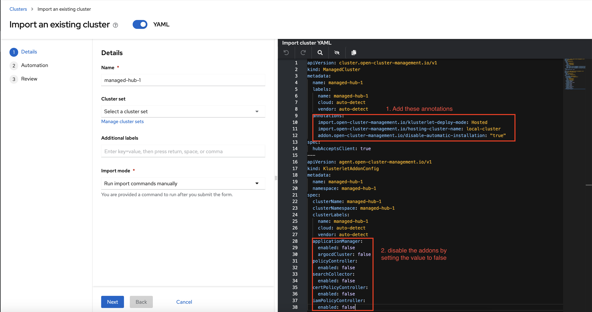
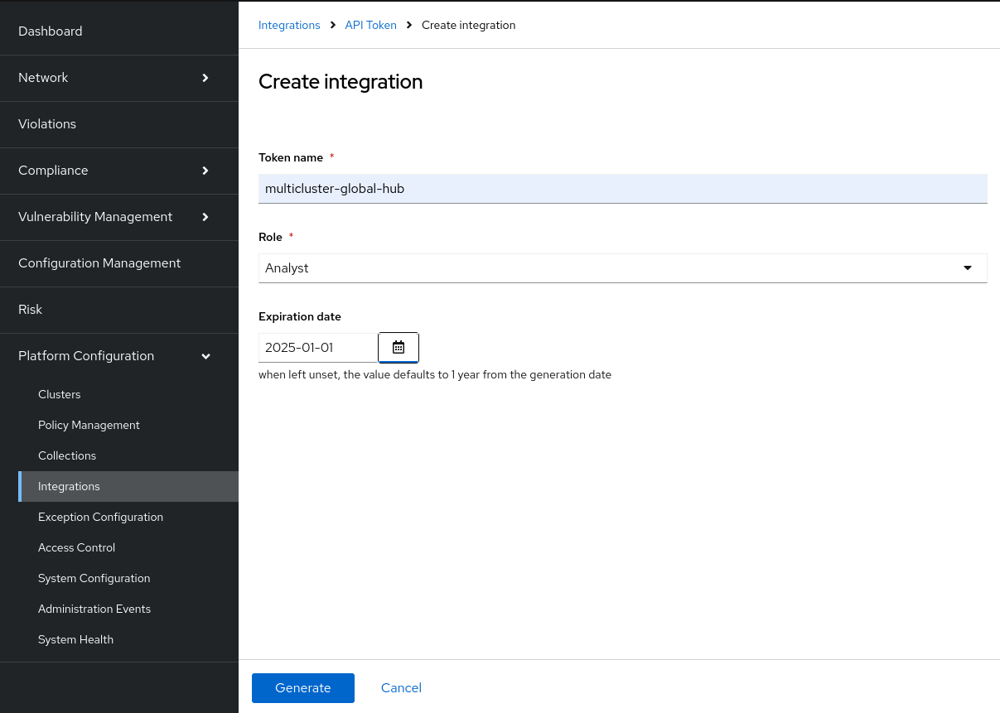
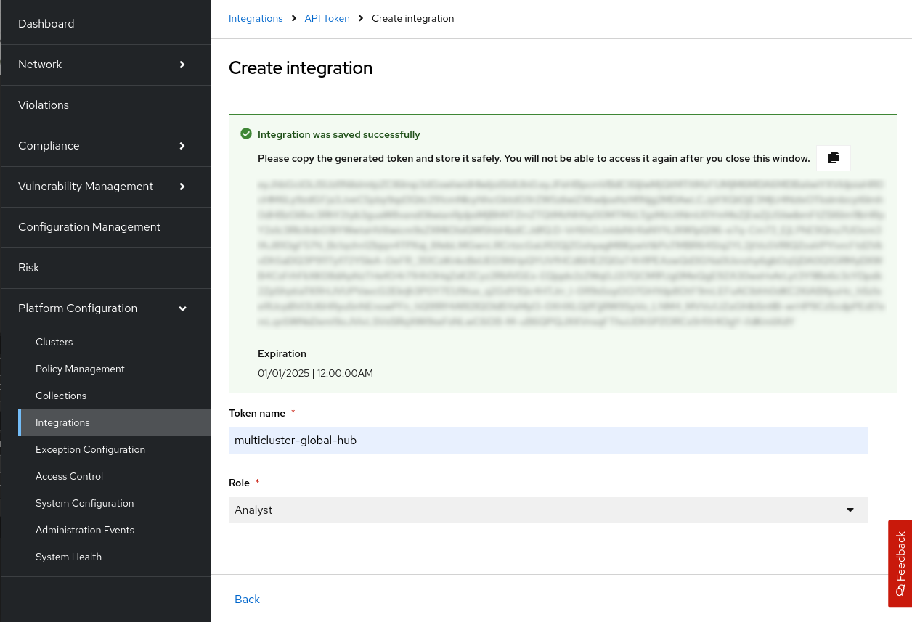

### Create a managed hub cluster (Developer Preview)
Refer to the original [Create cluster](https://access.redhat.com/documentation/en-us/red_hat_advanced_cluster_management_for_kubernetes/2.8/html/clusters/cluster_mce_overview#creating-a-cluster) document to create the managed cluster in the global hub cluster. Add the label of `global-hub.open-cluster-management.io/hub-cluster-install: ''` to the `managedcluster` custom resource and then the new created managed cluster can automatically be switched to be a managed hub cluster. In other words, the latest version of Red Hat Advanced Cluster Management for Kubernetes is installed in this managed cluster. You can get the Red Hat Advanced Cluster Management hub information in the cluster overview page.


### Import a managed hub cluster in hosted mode (Developer Preview)
A managed hub cluster does not require any changes before importing it. The Red Hat Advanced Cluster Management agent can be running in a hosting cluster.

1. Import the cluster from the Red Hat Advanced Cluster Management console by using `kubeconfig import mode`. Add these annotations to the `ManagedCluster` custom resource and disable all add-ons.

```
import.open-cluster-management.io/klusterlet-deploy-mode: Hosted
import.open-cluster-management.io/hosting-cluster-name: local-cluster
addon.open-cluster-management.io/disable-automatic-installation: "true"
```



2. Click `Next` to complete the import process.

3. Enable the work-manager addon after the imported cluster is available. The command likes:
```
cat << EOF | oc apply -f -
apiVersion: addon.open-cluster-management.io/v1alpha1
kind: ManagedClusterAddOn
metadata:
  name: work-manager
  namespace: managed-hub-1
  annotations:
    addon.open-cluster-management.io/hosting-cluster-name: local-cluster
spec:
  installNamespace: klusterlet-managed-hub-1
EOF
```
Notes:
- We need work-manager to tackle the manifestwork so that the global hub agent can be installed successfully.
- `managed-hub-1` is cluster namespace. You can specify what you want to use.
- `klusterlet-managed-hub-1` is the namespace where the global hub agent is installed. You can specify what you want to use.

4. We have an `external-managed-kubeconfig` secret generated in the `klusterlet-managed-hub-1` namespace. All addons can share it to access the managed hub cluster. You need to create `AddOnDeploymentConfig` to tell the addons to use the `external-managed-kubeconfig` secret. The command likes:
```
cat << EOF | oc apply -f -
apiVersion: addon.open-cluster-management.io/v1alpha1
kind: AddOnDeploymentConfig
metadata:
  name: addon-hosted-config
  namespace: multicluster-engine
spec:
  customizedVariables:
    - name: managedKubeConfigSecret
      value: external-managed-kubeconfig
EOF
```
Then patch work-manager with `oc patch clustermanagementaddon work-manager --type merge -p '{"spec":{"supportedConfigs":[{"defaultConfig":{"name":"addon-hosted-config","namespace":"multicluster-engine"},"group":"addon.open-cluster-management.io","resource":"addondeploymentconfigs"}]}}'`

5. Now, you can create the global hub agent to connect the managed hub cluster. You have to add the label to allow the global host agent running in Hosted mode by using
`oc label mcl managed-hub-1 global-hub.open-cluster-management.io/agent-deploy-mode=Hosted`. Then create global hub agent with the command:
```
cat <<EOF | oc apply -f - 
apiVersion: addon.open-cluster-management.io/v1alpha1
kind: ManagedClusterAddOn
metadata:
  name: multicluster-global-hub-controller
  namespace: managed-hub-1
  annotations:
    addon.open-cluster-management.io/hosting-cluster-name: local-cluster
spec:
  installNamespace: klusterlet-managed-hub-1
EOF
```

6. You can check the components in `klusterlet-managed-hub-1` namespace to ensure all the pods are running. The output likes:
```
NAME                                                           READY   STATUS    RESTARTS      AGE
klusterlet-addon-workmgr-65898cf697-dpc74                      1/1     Running   0             64m
klusterlet-managed-hub-1-registration-agent-7c76688f4d-vfjg9   1/1     Running   0             68m
klusterlet-managed-hub-1-work-agent-8576777749-2hf5v           1/1     Running   0             67m
multicluster-global-hub-agent-65d8d4947-gftzj                  1/1     Running   0             62m
```
### Enable Strimzi and Postgres Metrics
Collecting metrics is critical for understanding the health and performance of your Kafka deployment and postgres database. By monitoring metrics, you can actively identify issues before they become critical and make informed decisions about resource allocation and capacity planning. Without metrics, you may be left with limited visibility into the behavior of your Kafka deployment, which can make troubleshooting more difficult and time-consuming.

Globalhub set `enableMetrics: true` in the `spec` section by default.
After the kafka operator reconciling is completed, you can check the dashboards in global hub grafana. You will see the following dashboards under Strimzi folder:
- Global Hub - Strimzi Operator

- Global Hub - Strimzi Kafka

- Global Hub - Strimzi Zookeeper


The following dashboards will be in Postgres folder:
- Global Hub - PostgreSQL Database


### Enable StackRox integration

The [StackRox](https://www.stackrox.io) platform is a security solution, which helps detecting and
managing security risks and vulnerabilities. Its _Central_ component offers detailed information
about such security risks and vulnerabilities in the form of a collection of _security violations_.
The _Central_ web application includes a dashboard that shows a summary of those security violations
aggregated by severity:


The Global Hub can collect this information from the _Central_ instances that run inside the managed
hubs. The supported setup is to have a ACM Global Hub managing multiple instances of managed ACM
hubs. And each of these managed ACM hubs has one instance of _Central_ running.

The information is aggregated and presented in a new _Security Violations_ Grafana dashboard:


The integration requires one ACM Global Hub setup, with at least two ACM Managed Hubs and one
StackRox _Central_ instance running inside each of the ACM Managed Hubs. Each StackRox _Central_
instance needs to manage at least one cluster, otherwise there will be no violations to report and
the dashboard will be empty.

The integration is disabled by default. In order to enable it is necessary to have an ACM Global Hub
setup, with at least one ACM Managed Global Hub and configure the Global Hub _multiclusterglobalhub_
object and the StackRox _Central_ objects.

### Enabling the integration in the ACM Global Hub

The _multiclusterglobalhub_ object needs to have the
`global-hub.open-cluster-management.io/with-stackrox-integration` annotation. In a typical Global
Hub installation that can be achieved with a command like this:

```shell
$ oc annotate -n multicluster-global-hub multiclusterglobalhub multiclusterglobalhub \
global-hub.open-cluster-management.io/with-stackrox-integration=
```

The value of the annotation, an empty string in this example, isn't relevant; it just needs to be
present.

### Configuring each ACM Managed Hub

#### Create the StackRox API token

In each ACM Managed Hub the Global Hub Agent needs a API token to connect to the _Central_ instance.
That token can be created using the _Central_ web application. Go to _Platform Configuration_,
_Integrations_ and scroll down to _API Token_. In the dialog select a name, role and expiration date
for the token, then click the _Generate_ button:



The _Token name_ is not really relevant, but better use something that will help you remember what
it is used for.

The _Role_ is important: you need to select one that grants permission to get the security
violations. _Analyst_ is a built-in role that has that permission, as well as other read only
permissions. You may want to create your own _Permission Set_ set and _Role_ instead, so that it
only has read permission for security violations.

The _Expiration date_ is also important: you will need repeat the process described here before it
expires, otherwise when it expires the Global Hub will stop to collect the data from this _Central_.

The token will be displayed like this:



Make sure to copy the token to a safe place, as you will not be able to see it again once you close
that dialog.

For more details about tokens check the [StackRox
documentation](https://docs.openshift.com/acs/4.5/configuration/configure-api-token.html).

#### Obtain the StackRox API CA certificate

In addition to the token you will also need to have the certificate of the CA that needs to be
trusted in order to connect to the _Central_ API server. In a typical StackRox installation that CA
is generated by the _Central_ component, and the details are stored in the `ca.pem` key of the
`central-tls` secret. You can use a command like this to obtain it:

```bash
$ oc get secret -n rhacs-operator central-tls -o json | \
jq -r '.data["ca.pem"] | @base64d'
```

The result should be something like this:

```
-----BEGIN CERTIFICATE-----
MIIB0zCCAXigAwIBAgIUVD2jLKbwVW4+2zuYVNPCbra6AUYwCgYIKoZIzj0EAwIw
...
-----END CERTIFICATE-----
```

#### Create the StackRox API connection details secret

Once you have the token and the CA certificate you will need to put them inside a Kubernetes secret,
and annotate the `central` object with an annotation containing its location. The token should be in
the `token` key, and the CA certificate in the `ca` key, so it should look like this:

```yaml
apiVersion: v1
kind: Secret
type: Opaque
metadata:
  namespace: multicluster-global-hub-agent
  name: stackrox-connection-details
stringData:
  token: eyJ...
  ca: |
    -----BEGIN CERTIFICATE-----
    MIIB0zCCAXigAwIBAgIUVD2jLKbwVW4+2zuYVNPCbra6AUYwCgYIKoZIzj0EAwIw
    ...
    -----END CERTIFICATE-----
```

Note that this example is using `stringData` to avoid base64 encode step. If you prefer to use
`data` then you will have to encode the values. See the [Kubernetes
documentation](https://kubernetes.io/docs/concepts/configuration/secret/) for details.

Create that secret, and then add the
`global-hub.open-cluster-management.io/with-stackrox-credentials-secret` annotation to the `central`
object:

```shell
$ oc annotate -n rhacs-central central stackrox-central-services \
global-hub.open-cluster-management.io/with-stackrox-credentials-secret=multicluster-global-hub-agent/stackrox-connection-details
```

Note that the value of this annotation should be the namespace where you created the secret,
followed by a forward slash and then the name of the secret. The name of the secret is not relevant,
as long as you put it correctly in the value of the annotation. The secret must be in the namespace
the Global Hub Agent, typically `multicluster-global-hub-agent`.

Once the secret is created and the _central_ object annotated, the Global Hub Agent will
automatically detect the configuration, will apply it and will start to collect the information and
send it to the Global Hub Manager to populate the dashboard.


