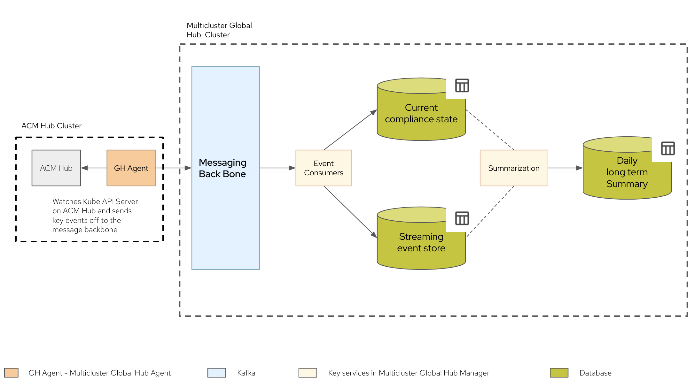

# How does Global Hub Work
Focus here will be on 2 key set of microservices in [architecture](./README.md) of the Multicluster Global Hub:
- Multicluster Global Hub Manager
- Multicluster Global Hub Agent

and how do they concretely create the high level summary of the many policies deployed across many clusters.

## Scenario
Let us imagine a possible installation scenario.
1. There are 700 managed clusters managed by multiple ACM hubs
1. Each of these managed clusters have around 30 policies deployed on them.
1. There are a total of 100 policies.
1. And a Multicluster Global Hub is added deliver these [Use Cases](./global_hub_use_cases.md)

### Summarization Process
How to summarize a single line that shows policy compliance across time. From the above, there are 21,000 (700*30) cluster-policy status-es that needs to be summarized. 

#### Key Steps
1. Events for 
    - policy creation
    - policy propapagtion to managed clusters and 
    - policy compliance for each of the managed cluster 
    
    [flows](#dataflow) into Global Hub
1. The raw events are saved in the database.
1. The current status of each policies is also saved in the database.
1. Each night - 00:00:00 hrs as per the clock of the cluster on which multicluster global hub runs - there is a summarization routine that kicks off. It is summarizes `a policy running on a cluster` to be `compliant or non-compliant or pending` for the past day. And this is done for all policies. This calculation is done on the basis of :
    - compliance state of the `policy on the cluster` at *end of the previous day*
    - changes(aka events) to the `policy on the cluster` *during the previous day*
    - compliance state of a cluster is a logical AND of daily summarized status of all polcies on the cluster.

#### Summarization Rule
|State of Policy on a cluster at end of previous day|Events related to the Policy on the cluster during the previous day| Calculated Summarized state for the previous day|
|---|---|---|
|compliant| No non-compliant event have come during the day| compliant|
|compliant| Even one Non-compliant event have come during the day| non-compliant|
|non-compliant| does not matter| non-compliant|
|pending| does not matter| pending|

In the long run, the desired state is full compliance. If daily variations as captured above continues to persist, it needs to be investigated. And this will also bring out anamolous behaviour if any - that is: the fleet is largely compliant barring a few outliers.

#### Dataflow    

Note:
- multicluster global hub operator controls the life cycle of the multicluster global hub manager and global hub agent
- kafka and database can run on the Global cluster or outside it
- ACM hub also runs on the multicluster global hub cluster, but does not participate in the daily functioning of the global hub.