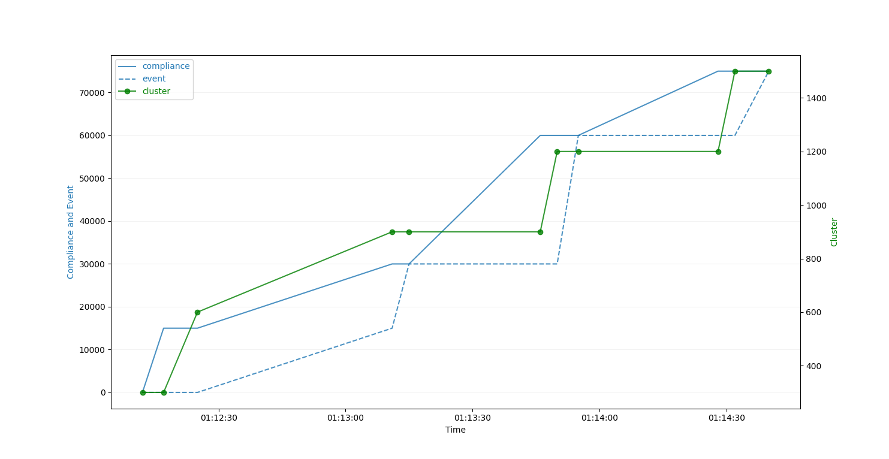

# Simulation at High Scale

## Environment

This simulation requires a **Red Hat OpenShift Container Platform clusters**. And also you need a virtual machine to create the KinD cluster and managed hub. Then we will mock the resources on the KinD cluster and observe the status on the database. The overall architecture is shown in the figure below.


You can use the scale test environment to simulate a large-scale cluster. Since the transport status path is very sensitive to the performance and represents a scale larger than the spec path.

There are two main metrics to express the scalability of global hubs:

- Initialization: The time to load all managed clusters and Policies to the Global Hub
- Policy status rotation: Rotate all the policies on the managed hubs and verify status changes on the database and observe the CPU and Memory consumption of the components.

## Initialization 


  

  The results above illustrate the growth of records in the databasae over time, indicating that these 5 managed hubs took approximately 5 minutes from initially receiving data to synchronizing all compliance status and clusters with the database.

- Check the CPU consumption

  
  

  It can be seen from the above graph that the CPU changes with the amount of data. The `multicluster-global-hub-grafana` CPU exhibits minor fluctuations, basically keep below `10m`. However, the `multicluster-global-hub-manager` CPU shows significant ups and downs in reponse to the data changes. It reaches its peak at `171 m`, and as the processing data decreases, it will be as low as `5 m` or less.

- Check the Memory consumption

  
  

  Unlike the CPU consumption, the memory consumption remains relatively consistent without frequent fluctuations. After all the data was inserted into the database, the consumption of  `multicluster-global-hub-grafana` memory reaches its peak at `186 MiB` and subsequently remained around `143 MiB`. Without processing any data, the `multicluster-global-hub-manager` has a memory usage of approximately `52 MiB`, Afther caching all the necessary data from the managed hub, its memory usage increased to around `190 MiB`.

## Policy Status Rotation

We are using the `./local-policies/rotate-policy.sh` to update the status of the replicas policies on each managed hub. Every time the status of `5000` replicas policies is updated, wait `10` minutes before continuing, so that the compliance status in the database can be regularly found to be updated at intervals of `5000`. 

- Update the policy status on managed hub

```bash
# update the 50 root policy on the 300 cluster, and update the status to Compliant(default NonCompliant)
$ ./doc/simulation/local-policies/rotate-policy.sh 50 300 "Compliant"
# $ ./doc/simulation/local-policies/rotate-policy.sh 50 300 "NonCompliant"
```

- Observe the status count of the compliance from database.
```bash
$ ./doc/simulation/stopwatch-compliance.sh 2>&1 | tee ./doc/simulation/compliance.log
```

- The CPU and Memory consumption of the `multicluster-global-hub`
 
 

  We can see that the  `multicluster-global-hub-manager` need more CPU resource when updating all the policy status. The maximum value can be up to `800m`, the rest are fluctuating around `250m`. After processing the all the rotation policies, keep it to about `6m`.

  The memory consumption of `multicluster-global-hub-manager` stay around `370 MiB` when rotating the policies. And then fall back to about `180 MiB` after updating all the policy status.

- The CPU and Memory consumption of the Postgres Pods
  
  

- The CPU and Memory consumption of the Kafka pods
  
  

## Related Material

- [Red Hat Advanced Cluster Management Hub-of-hubs Scale and Performance Tests](https://docs.google.com/presentation/d/1z6hESoacKRHuBQ-7I8nqWBuMnw7Z6CAw/edit#slide=id.p1)
- [Replace Global Hub Transport with Cloudevents](https://github.com/stolostron/multicluster-global-hub/issues/310)
