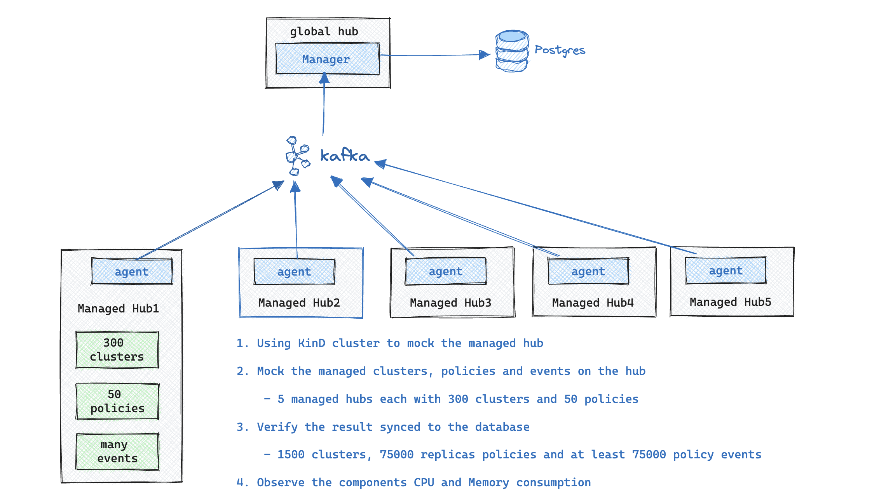
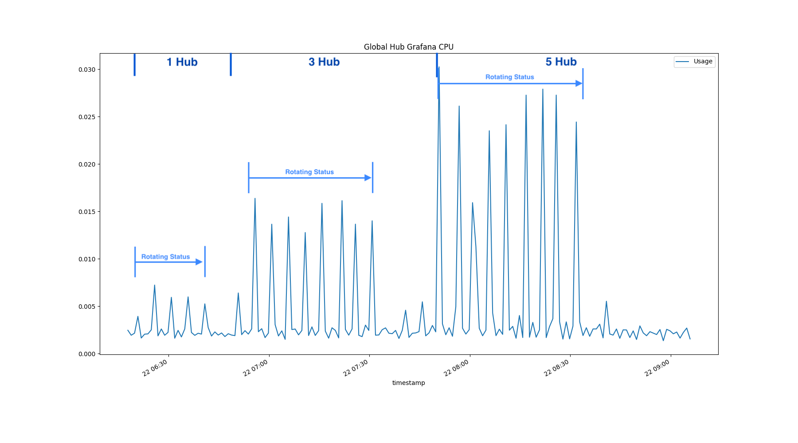

# Simulation at High Scale

## Environment

This simulation requires a **Red Hat OpenShift Container Platform clusters**. And also you need a virtual machine to create the KinD cluster and managed hub. Then we will mock the resources on the KinD cluster and observe the status on the database. The overall architecture is shown in the figure below.

You can use the scale test environment to simulate a large-scale cluster. Since the transport status path is very sensitive to the performance and represents a scale larger than the spec path.

There are several points we need to consider when simulating the global hub at large scale:

- Initialization: The time to load all managed clusters and Policies to the Global Hub
- Policy status rotation: Rotate all the policies on the managed hubs and verify status changes on the database and observe the CPU and Memory consumption of the components.

## Analysis

You can setup `5` hubs, each with `300` clusters, `15000` replicas policies and at least `15000` policy events, by following the [setup guidance](./setup/README.md). Then run the global hub [inspector](./inspector/README.md) to view the data from database, and analysis the CPU and Memory consumptions of the global hub components.

The simulation steps are as follows:

1. Install the global hub and then join the `5` simulated managed hubs into it.

2. Deploy the **multicluster-global-hub-agent** to the **hub1** cluster and then rotating all the policies to update status from one to another, Like changing the all the status from `Complianct` to `NonCompliant`

3. After the step 2, apply the **agent** to **hub2** and **hub3**, then rotating all the status.

4. At last, repeat the step 3 to deploy the **agent** to **hub4** and **hub5**, and updating the status.

Through the above steps, we can see the changing trends of the global hub metrics under the management of `1`, `3` and `5` hubs.

### The Count of the Global Hub Data from database

The global hub counters are used to count the managed clusters, compliances and policy events from database over time. 

- The Managed Clusters

- The Compliances

- The Policy Events

### The CPU and Memory Consumption of the Global Hub Components

- Multicluster Global Hub Manager

  | Manager | Request | Limit |
  |---|---|---|
  | CPU | 0.1 | 0.5 |
  | Memory | 100 MB | 300 MB |

- Multicluster Global Hub Grafana

- Multicluster Global Hub Operator

  | Operator | Request | Limit |
  |---|---|---|
  | CPU | 0.001 | 0.05 |
  | Memory | 100 MB | 200 MB |

- Multicluster Global Hub Agent on Managed Hub

  | Agent | Request | Limit |
  |---|---|---|
  | CPU | 0.01 | 0.05 |
  | Memory | 200 MB | 1000 MB |

### The CPU and Memory Consumption of the Middlewares

- Multicluster Global Hub Kafka Broker

  | KafkaBroker | Request | Limit |
  |---|---|---|
  | CPU | 0.004 | 0.2 |
  | Memory | 1.5 G | 5 G |

- Multicluster Global Hub Kafka Zookeeper

  | KafkaZookeeper | Request | Limit |
  |---|---|---|
  | CPU | 0.01 | 0.02 |
  | Memory | 0.8 G | 2 G |

- Multicluster Global Hub Postgres

| Postgres | Request | Limit |
|---|---|---|
| CPU | 0.5 | 5 |

## Related Material

- [acm-inspector](https://github.com/bjoydeep/acm-inspector)
- [Red Hat Advanced Cluster Management Hub-of-hubs Scale and Performance Tests](https://docs.google.com/presentation/d/1z6hESoacKRHuBQ-7I8nqWBuMnw7Z6CAw/edit#slide=id.p1)
- [Replace Global Hub Transport with Cloudevents](https://github.com/stolostron/multicluster-global-hub/issues/310)