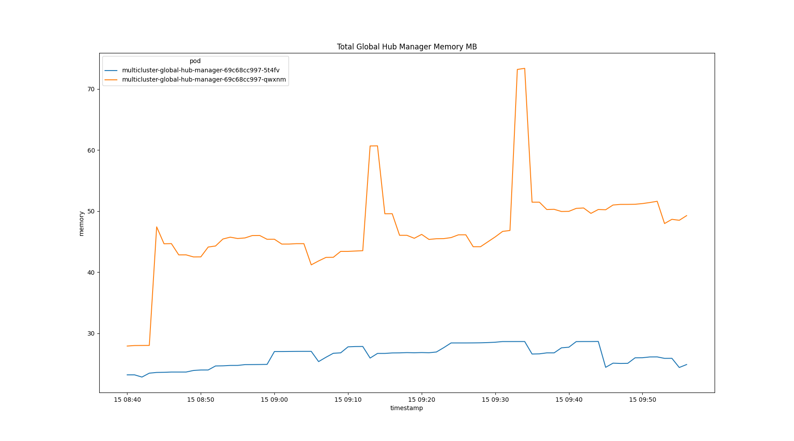
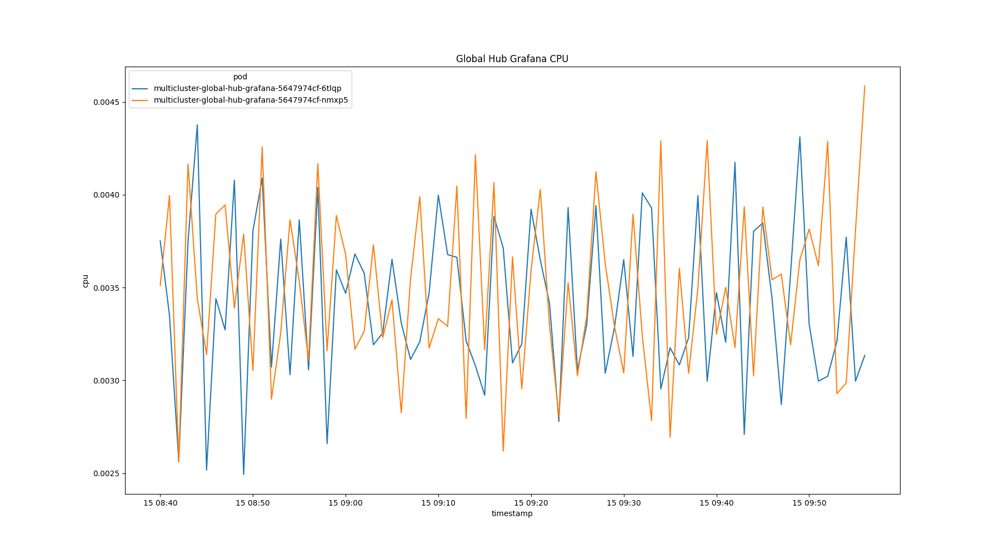
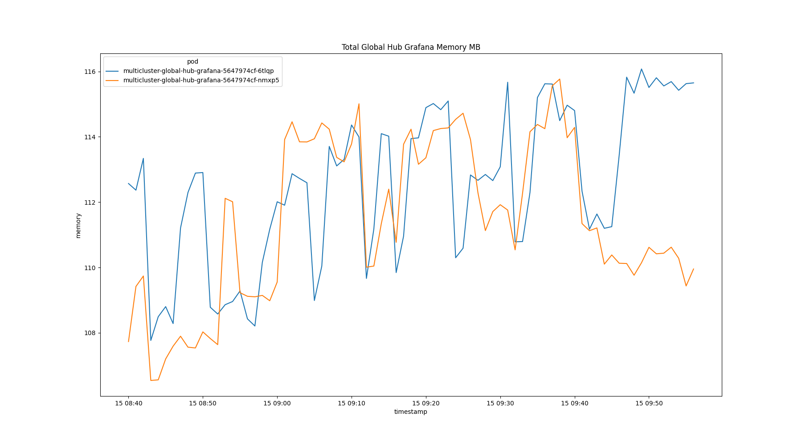
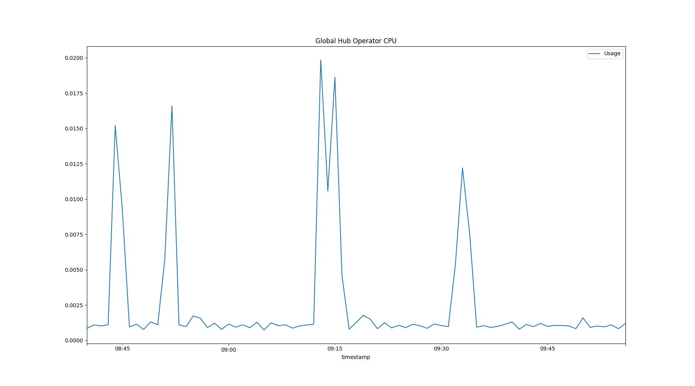
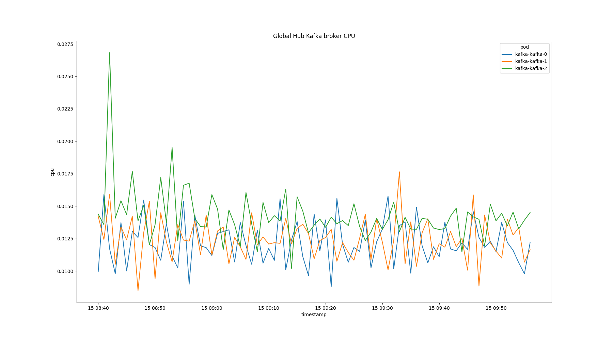
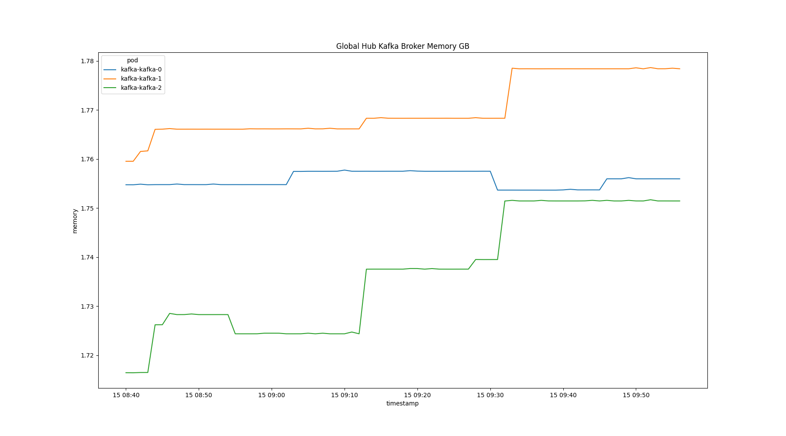
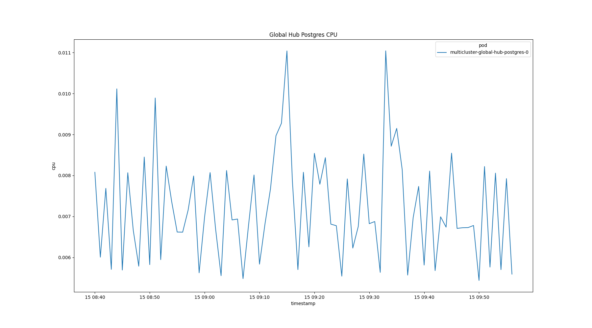
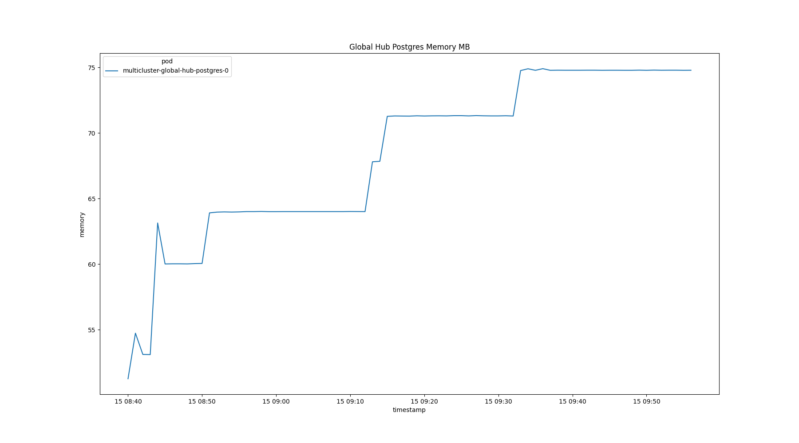

# Scenario 1: Initialize 6k clusters to Global Hub

## Scale

- 2 Managed Hubs, Each with 3k Managed Clusters
- 6k Managed Clusters

## Step

0. Start counter with `./doc/simulation/inspector/cmd/counter.sh start`

1. Install the global hub and then join the 2 simulated managed hubs, each with 1000 clusters, into it

   ```bash
   # simulate 2 hubs and each with 1000 clusters
   ./doc/simulation/setup/setup-cluster.sh 1:2 1000 
   # deploy agent 
   kubectl label mcl hub1 vendor=OpenShift --overwrite
   kubectl label mcl hub2 vendor=OpenShift --overwrite
   ```

2. Detach the 2 hubs, and then simulate 2000 clusters on each hub, rejoin them into global hub

    ```bash
    # simulate 2 hubs and each with 2000 clusters
    ./doc/simulation/setup/setup-cluster.sh 1:2 2000
    # deploy agent 
    kubectl label mcl hub1 vendor=OpenShift --overwrite
    kubectl label mcl hub2 vendor=OpenShift --overwrite
    ```

3. Detach the 2 hubs, and then simulate 3000 clusters on each hub, rejoin them into global hub

    ```bash
    # simulate 2 hubs and each with 3000 clusters
    ./doc/simulation/setup/setup-cluster.sh 1:2 3000
    # deploy agent 
    kubectl label mcl hub1 vendor=OpenShift --overwrite
    kubectl label mcl hub2 vendor=OpenShift --overwrite
    ```

4. Stop counter and draw the data trend in database 

    ```bash
    # draw the graph
    ./doc/simulation/inspector/cmd/counter.sh draw
    # stop the counter
    ./doc/simulation/inspector/cmd/counter.sh start
    ```

5. Generate the CPU and Memory of the Global Hub Components

   ```bash
   ./doc/simulation/inspector/cmd/check.sh "2023-11-15 08:40:00" "2023-11-15 09:56:37"
   ```

## Statistics and Analysis

### The Count of the Global Hub Resources from Database

- The Managed Clusters


### The CPU and Memory Consumption of the Global Hub Components

- Memory trends with clusters scale changes

  ---
  | Cluster Scale | Max Manager Memory | Max Grafana Memory | Max Postgres Memory | Max Kafka Broker Memory | Max Kafka Zookeeper Memory |
  |---|---|---|---|---|---|
  | 2k | 48 Mi | 113 Mi | 64.5 Mi | 1.767 Gi | 1.782 Gi |
  | 4k | 62 Mi | 115.6 Mi | 72 Mi | 1.77 Gi | 1.782 Gi |
  | 6k | 73 Mi | 116 Mi | 75 Mi | 1.777 Gi | 1.782 Gi |

- CPU trends with clusters scale changes

  ---
  | Cluster Scale | Max Manager CPU | Max Grafana CPU | Max Postgres CPU | Max Kafka Broker CPU | Max Kafka Zookeeper CPU |
  |---|---|---|---|---|---|
  | 2k | 4.8m | 4.4m | 10m | 26.5m | 12.6m |
  | 4k | 6.5m | 4.4m | 11m | 26.5m | 12.6m |
  | 6k | 8.2m | 4.6m | 11m | 26.5m | 12.6m |

- Multicluster Global Hub Manager



- Multicluster Global Hub Grafana



- Multicluster Global Hub Operator



- Multicluster Global Hub Kafka Broker



- Multicluster Global Hub Kafka Zookeeper


- Multicluster Global Hub Postgres



### The PVCs of the Global Hub Middlewares

- Multicluster Global Hub Kafka


- Multicluster Global Hub Postgres

