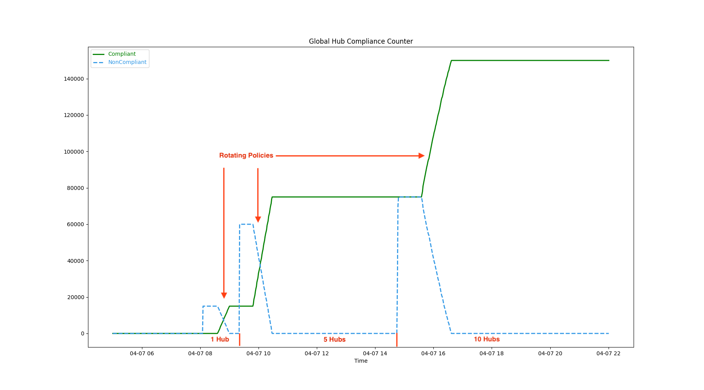
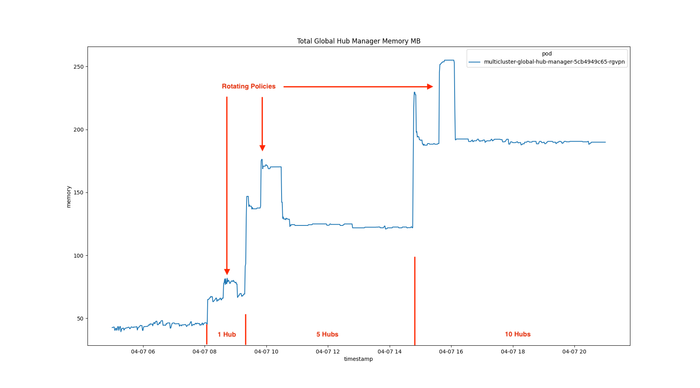
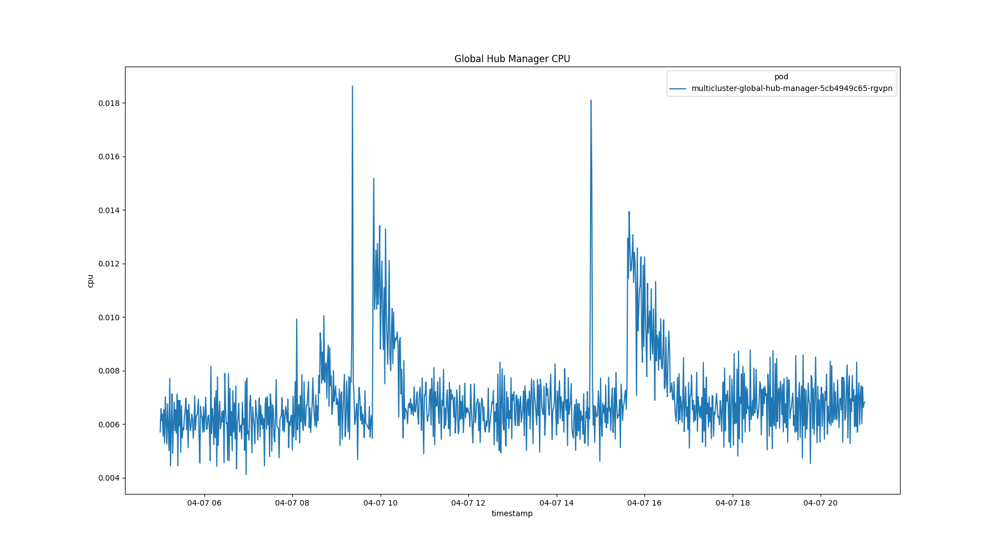
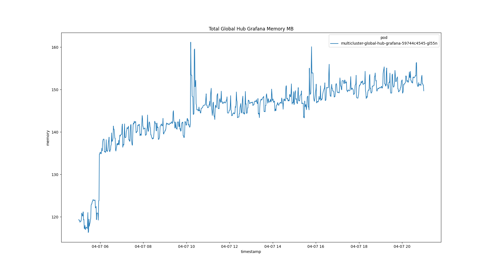
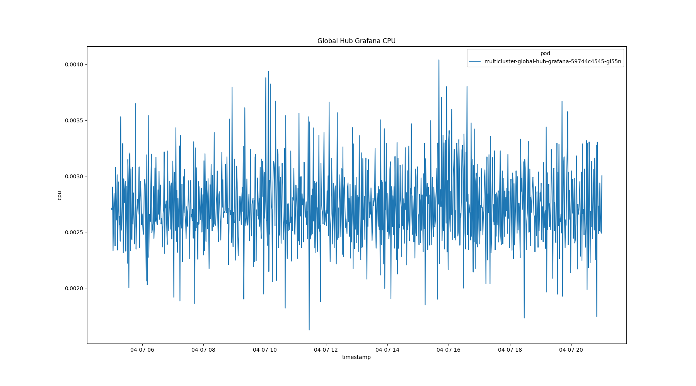
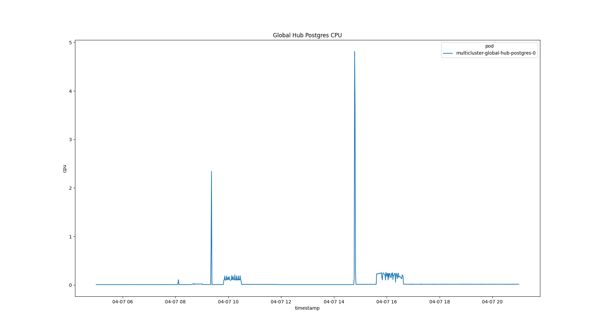
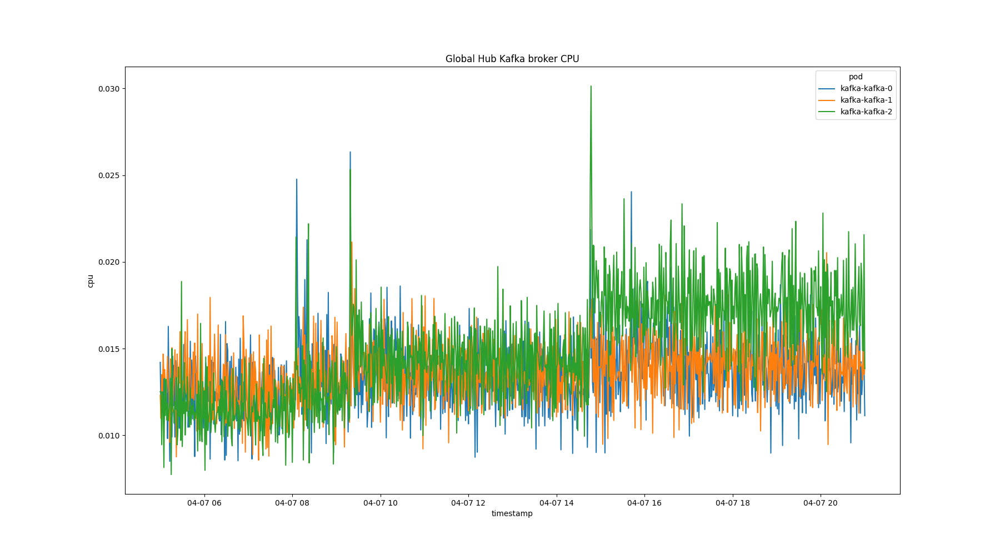
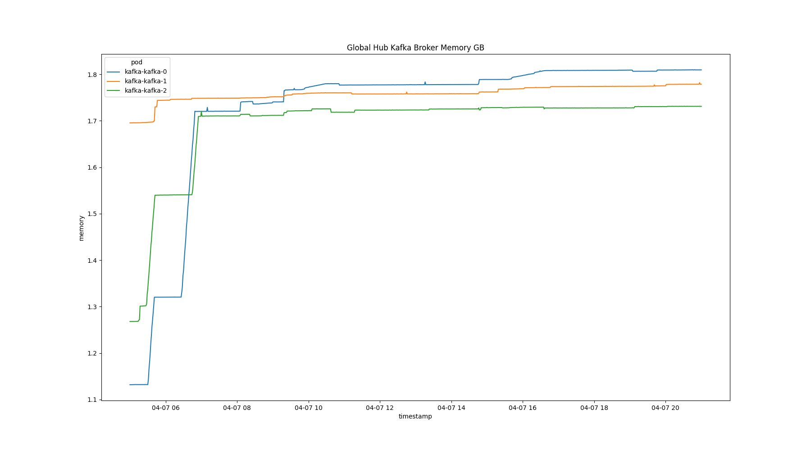
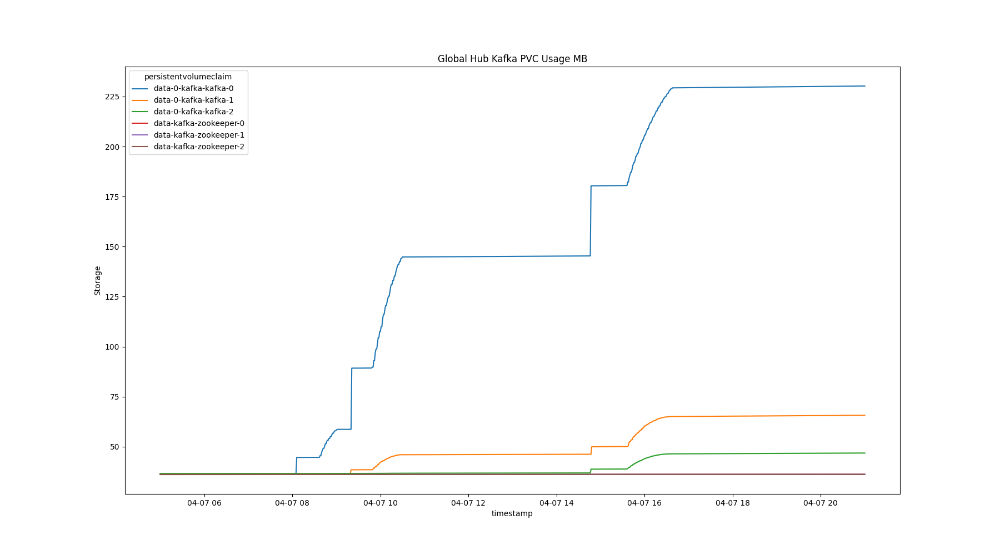

# Scenario 3: Manage 3,000 clusters and 500 policies(release-2.11/globalhub-1.2)

## Scale

- 10 Managed Hubs, Each with 300 Managed Clusters, 50 Policies
- 3,000 Managed Clusters
- 500 Policies, 150,000 Replicated Policies

## Environment

1. Install the global hub and then join the `1` simulated managed hubs into it

2. Deploy the `multicluster-global-hub-agent` to the `hub1` cluster and then rotating all the policies to update status, Like changing the all the status from `Compliant` to `NonCompliant`

3. After the step 2, apply the agent to `hub2`, `hub3`, `hub4` and `hub5`, then rotating all the status.

4. At last, repeat the step 3 to deploy the agent to `hub6` ~ `hub10`, and updating the status.

Through the above steps, we can see the changing trends of the global hub metrics under the management of 1, 5 and 10 hubs.

## Statistics and Analysis

### The Count of the Global Hub Data from database

The global hub counters are used to count the managed clusters, compliances and policy events from database over time. 

- The Managed Clusters and Compliance


- The Compliances


- The Policy Events


### The CPU and Memory Consumption of the Global Hub Components

- Multicluster Global Hub Manager




- Multicluster Global Hub Grafana




- Multicluster Global Hub Operator


- Multicluster Global Hub Agent on Managed Hub


Check the agent memory on the simulated cluster
```bash
cat /sys/fs/cgroup/memory.current
284188672 # 270.95 MB 
```

### The CPU and Memory Consumption of the Middlewares

- Multicluster Global Hub Postgres





- Multicluster Global Hub Kafka Broker





- Multicluster Global Hub Kafka Zookeeper


### CPU and Memory Summary

  ---
  | Type               | Manager | Agent | Operator | Grafana | Postgres | Kafka Broker | Kafka Zookeeper |
  |---                 |---      |---    |---       |---      |---       |---           |---              |
  | Request CPU(m)     | 5       | 10    | 2        | 5       | 100      | 20           | 10              |
  | Limit CPU(m)       | 500     | 50    | 100      | 50      | 8000     | 200          | 50              |
  | Request Memory(Mi) | 60      | 300   | 70       | 150     | 60       | 1.5 Gi       | 800             |
  | Limit Memory(Mi)   | 500     | 1200  | 200      | 800     | 1000     | 5   Gi       | 2   Gi          | 
