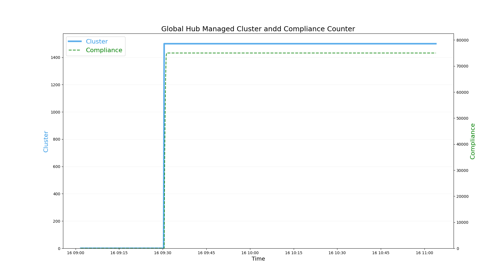
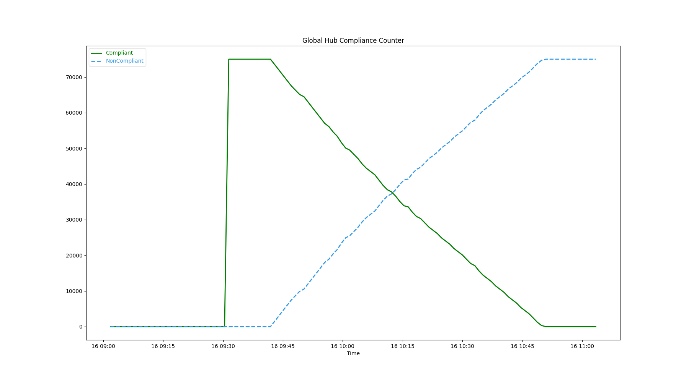
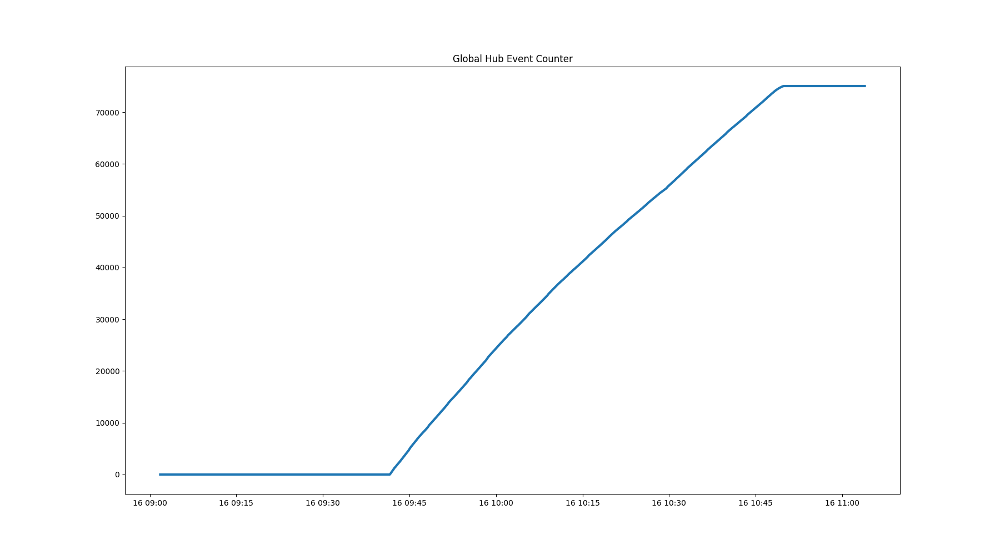
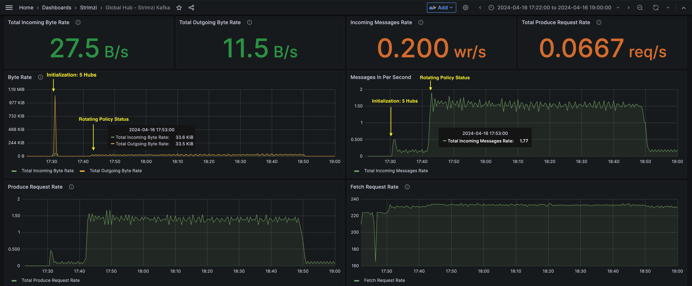
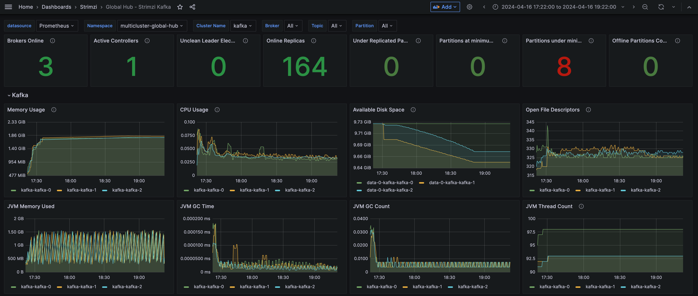
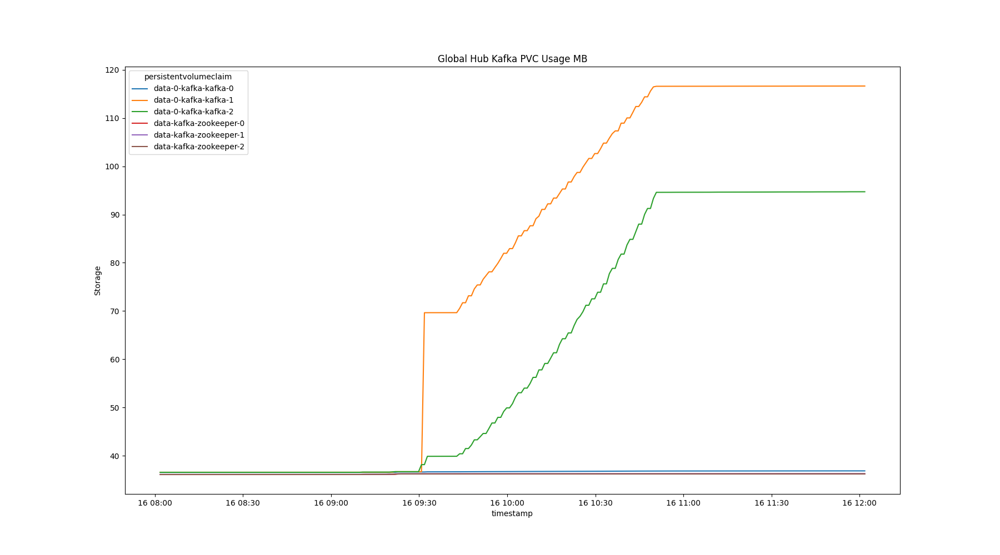

# Scenario 4: Kafka Metrics(release-2.11/globalhub-1.2)

## Scale

- 5 Managed Hubs, Each with 300 Managed Clusters, 50 Policies
- 1500 Managed Clusters
- 250 Policies, 75,000 Replicated Policies

## Environment

1. Install the global hub and then join the 5 simulated managed hubs into it

2. Deploy the `multicluster-global-hub-agent` to the `hub1` ~ `hub5` cluster

3. Rotating all the policies to update status, Like changing the all the status from `Compliant` to `NonCompliant`

4. Observe the metrics from the dashboard.

## Kafka Setting

- Kafka Cluster
  - Version: `3.6.0`
  - Broker Replicas: `3`
  - Broker Storage Size: `10Gi`
  - Zookeeper Replicas: `3`
  - Zookeeper Storage Size: `10Gi`

- Kafka Topic(`event, spec, status.<cluster>`)
  - Topic Partition Replicas: `1`
  - Topic Partition: `1`
  - Default retention: `7 days`

- Check the Kafka CR and Dashboards for More Detail
  - Kafka CR

    ```yaml
    apiVersion: kafka.strimzi.io/v1beta2
    kind: Kafka
    metadata:
      creationTimestamp: "2024-04-16T07:49:10Z"
      generation: 1
      labels:
        global-hub.open-cluster-management.io/managed-by: global-hub
      name: kafka
      namespace: multicluster-global-hub
    spec:
      kafka:
        authorization:
          type: simple
        config:
          default.replication.factor: 3
          inter.broker.protocol.version: "3.6"
          min.insync.replicas: 2
          offsets.topic.replication.factor: 3
          transaction.state.log.min.isr: 2
          transaction.state.log.replication.factor: 3
        ...
        replicas: 3
        resources:
          limits:
            memory: 4Gi
          requests:
            cpu: 25m
            memory: 128Mi
        storage:
          type: jbod
          volumes:
          - deleteClaim: false
            id: 0
            size: 10Gi
            type: persistent-claim
        version: 3.6.0
      zookeeper:
        metricsConfig:
          type: jmxPrometheusExporter
          valueFrom:
            configMapKeyRef:
              key: zookeeper-metrics-config.yml
              name: kafka-metrics
        replicas: 3
        resources:
          limits:
            memory: 3Gi
          requests:
            cpu: 20m
            memory: 500Mi
        storage:
          deleteClaim: false
          size: 10Gi
          type: persistent-claim
    ```

  - Kafka Dashboard without Workload
  
  

## Initializing and Rotating Policies

### The Count of the Global Hub Data from database

The global hub counters are used to count the managed clusters, compliances and policy events from database over time. 

- The Managed Clusters


- The Compliances


- The Policy Events


### Throughputs and Message Rate



- The Max Message Size: `1MB`

- Initialization: Import `5 hubs`

  - Max Incoming Byte Rate: `57.5KB`
  - Max Outgoing Byte Rate: `1.09MB`
  - Max Incoming Message Rate(messages/second): `0.5`

- Rotating Policy Status

  - Average Incoming Byte Rate: `20KB`
  - Average Outgoing Byte Rate: `20KB`
  - Average Incoming Message Rate(messages/second): `1.53`


### Other Metrics





