# Scenario 6: Manage 3,000 clusters and 500 policies(release-2.13)

## Note

- Switch the Kafka cluster to Kraft mode.
- Commit Image:  `fde5a1ff7e1b818b8f90e2c15f511ad46fa3e637`
- Ensure that `pprof` is enabled when setting up the environment

## Scale

- 10 Managed Hubs, Each with 300 Managed Clusters, 50 Policies
- 3,000 Managed Clusters
- 500 Policies, 150,000 Replicated Policies

## Simulation workflow

1. Initialize 2 Virtual Machines, each with 5 KinD clusters

2. Join the above the 10 clusters into the Global Hub

3. Deploy the `multicluster-global-hub-agent` to the `hub1` cluster using:

  ```bash
  kubectl label mcl hub1 vendor=OpenShift --overwrite
  ```

4. Rotate all the policies to update their statuess, e.g., changing all the statuses from `Compliant` to `NonCompliant`

5. Repeat steps 3 and 4, apply the agent to `hub2`, `hub3`, `hub4`, and `hub5`, and then rotate all the statuses.

6. Repeat steps 3 and 4 to deploy agent to `hub6` through `hub10`, and update the statuses accordingly.

Through the above steps, we can see the changing trends of the global hub metrics under the management of 1, 5 and 10 hubs.

## Statistics and Analysis

### The Count of the Global Hub Data from database

The global hub counters are used to count the managed clusters, compliances and policy events from database over time. 

- The Managed Clusters and Compliance
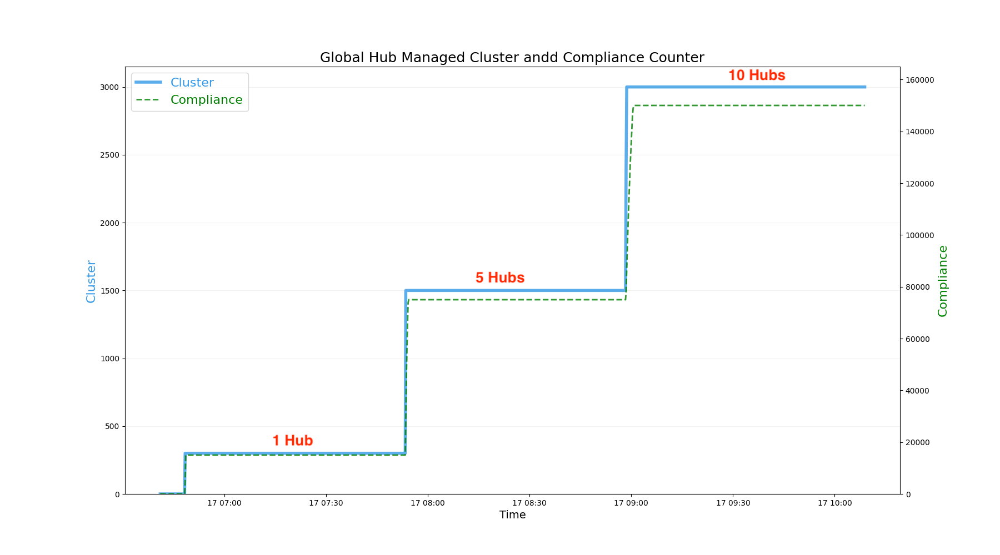

- The Changes of Compliance
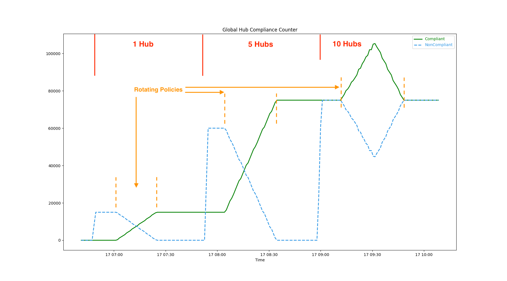

### The CPU and Memory of the Global Hub Components

- Multicluster Global Hub Manager

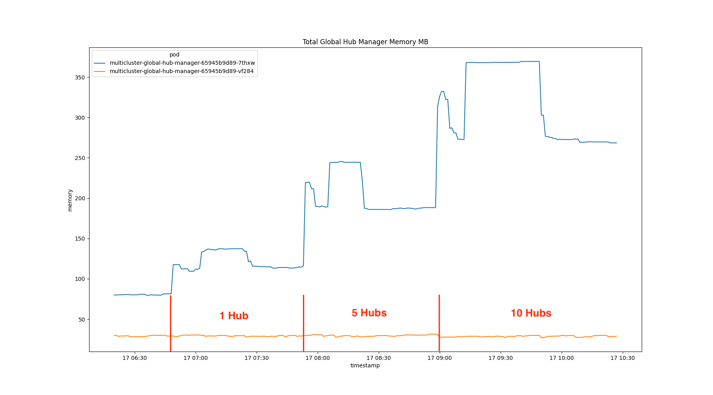
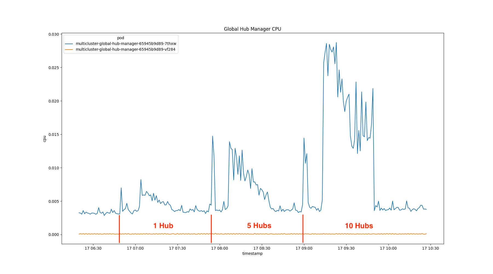

- Multicluster Global Hub Grafana

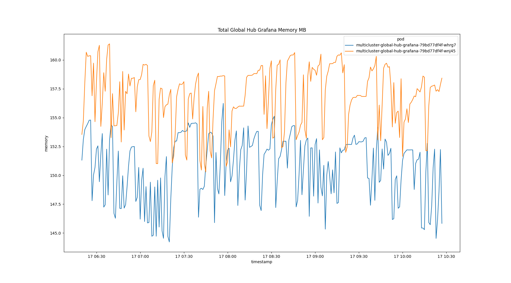
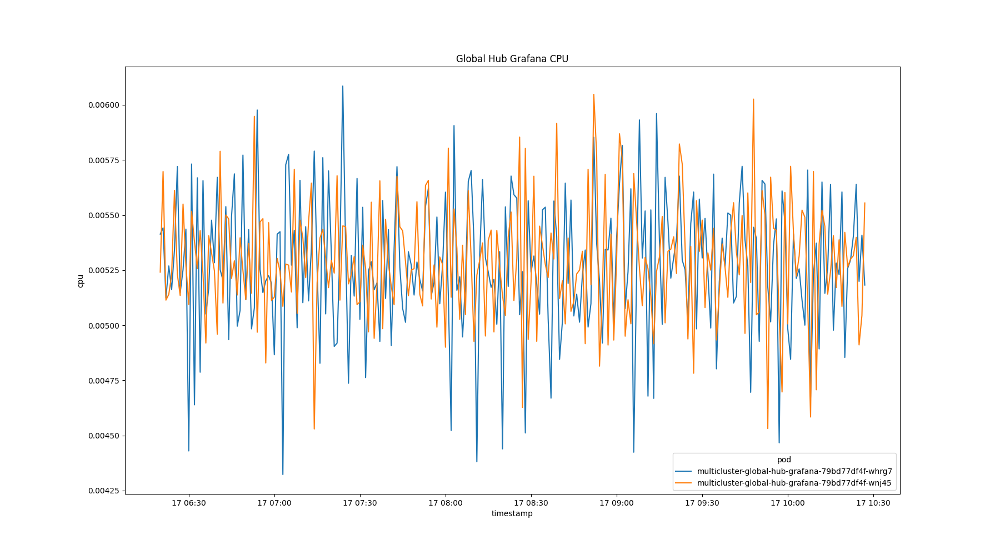

- Multicluster Global Hub Operator

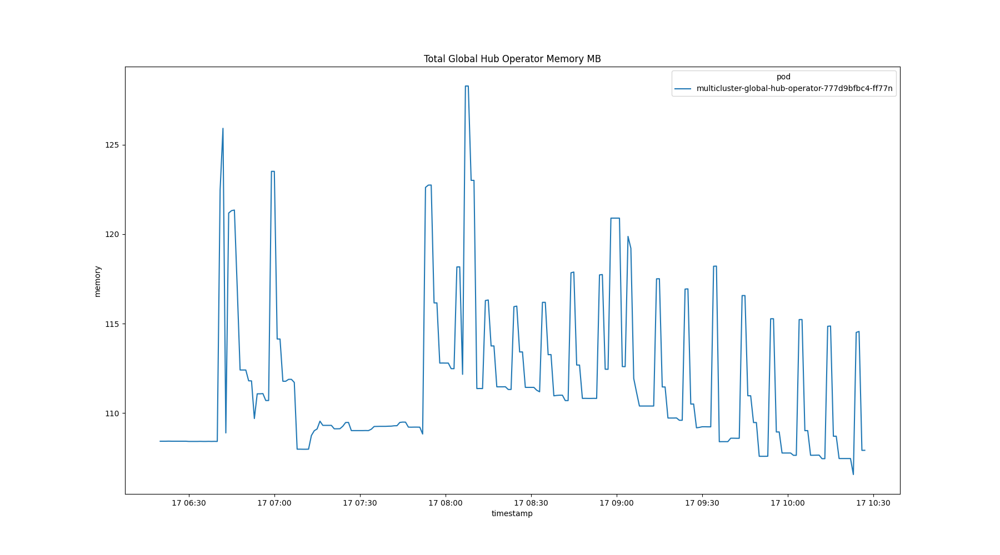
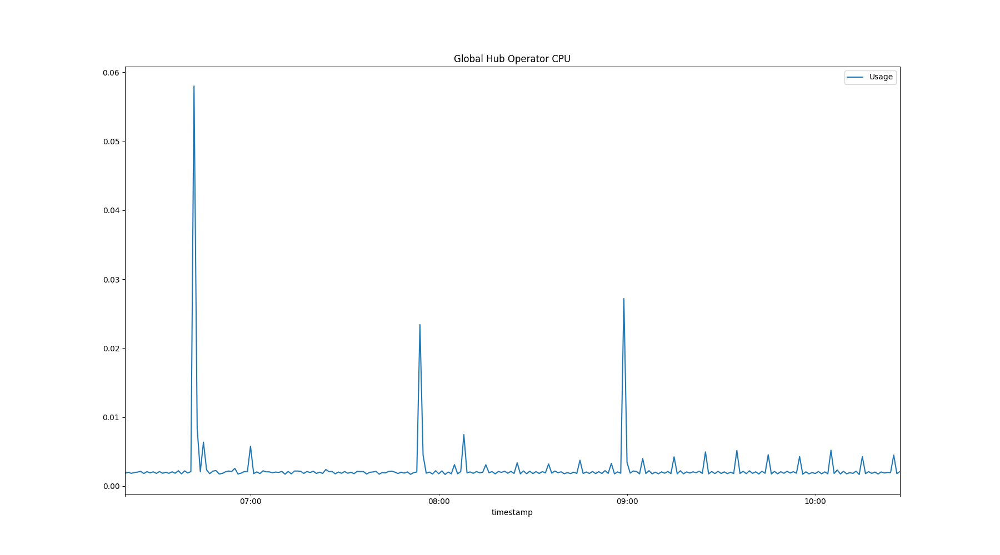

- Multicluster Global Hub Agent on Managed Hub

<!-- 
 -->

Check the agent memory on the simulated cluster

```bash
# hub1 -> 294 MB
cat /sys/fs/cgroup/memory.current
307929088
# hub4 -> 295 MB
$  cat /sys/fs/cgroup/memory.current
309264384
# hub7 -> 264 MB
cat /sys/fs/cgroup/memory.current
276987904
```

### The CPU and Memory of the Middlewares

- Multicluster Global Hub Postgresql

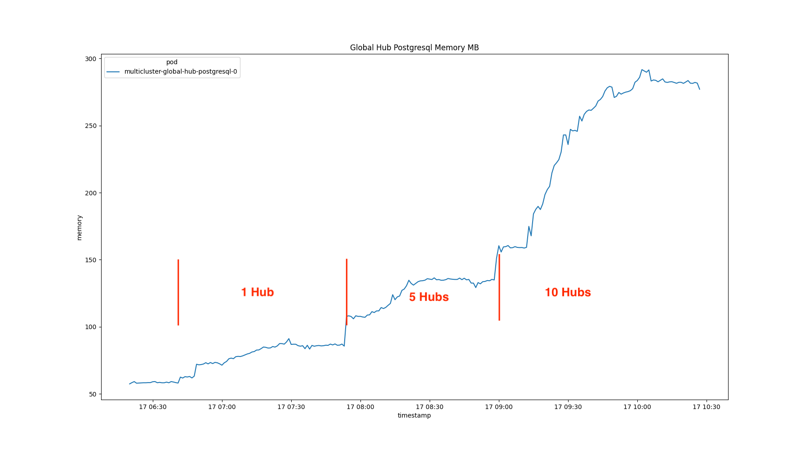

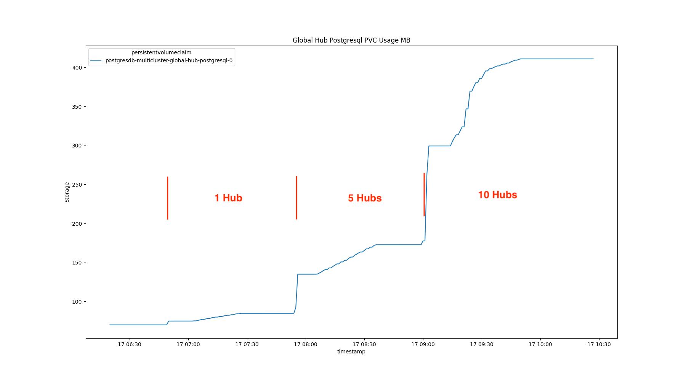

- Multicluster Global Hub Kafka

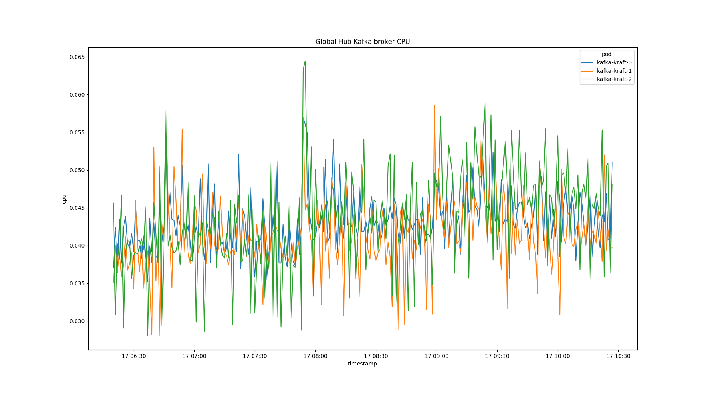

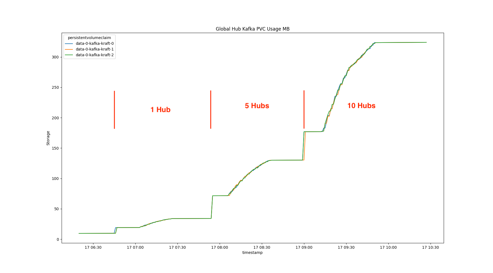


### CPU and Memory Summary

> Note: The following value is for each pod, in the high availability mode, there are 3 replicas for each kafka broker, and 2 replicas for manager
  

- 1500 clusters(5 hub, each with 300 clusters and 50 policies)

  - Maximum CPU and memory usage for each component

  ---
  | Type               | Manager | Agent | Operator | Grafana | Postgresql | Kafka Broker |
  |---                 |---      |---    |---       |---      |---         |---           |
  | Maximum CPU(m)     | 15      | 10    | 60       | 6.5     | 2200       | 65           |
  | Maximum Memory(Mi) | 260     | 300   | 130      | 165     | 130        | 3.92   Gi    |

  - Recommendation CPU and memory usage for each component

  ---
  | Type               | Manager | Agent | Operator | Grafana | Postgresql | Kafka Broker |
  |---                 |---      |---    |---       |---      |---       |---           |
  | Request CPU(m)     | 5       | 10    | 2        | 5       | 100      | 20           |
  | Limit CPU(m)       | 30      | 20    | 120      | 30      | 4400     | 150          |
  | Request Memory(Mi) | 60      | 300   | 70       | 150     | 60       | 2   Gi       |
  | Limit Memory(Mi)   | 512     | 512   | 256      | 512     | 256      | 5   Gi       |

- 3000 clusters(10 hub, each with 300 clusters and 50 policies)

  - Maximum CPU and memory usage for each component

  ---
  | Type               | Manager | Agent | Operator | Grafana | Postgresql | Kafka Broker |
  |---                 |---      |---    |---       |---      |---         |---           |
  | Maximum CPU(m)     | 29      | 10    | 60       | 6.5     | 5000       | 65           |
  | Maximum Memory(Mi) | 370     | 300   | 130      | 165     | 290        | 4   Gi       |

  - Recommendation CPU and memory usage for each component

  ---
  | Type               | Manager | Agent | Operator | Grafana | Postgresql | Kafka Broker |
  |---                 |---      |---    |---       |---      |---       |---           |
  | Request CPU(m)     | 5       | 10    | 2        | 5       | 100      | 20           |
  | Limit CPU(m)       | 60      | 50    | 120      | 50      | 8000     | 168          |
  | Request Memory(Mi) | 60      | 300   | 70       | 150     | 60       | 2   Gi       |
  | Limit Memory(Mi)   | 600     | 600   | 256      | 800     | 600      | 6   Gi       |