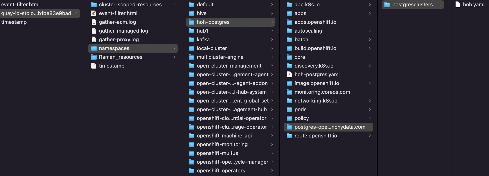

## Access to the [provisioned postgres database](../operator/config/samples/storage/deploy_postgres.sh)

In combination with the type of service, three ways are provided here to access this database.

1. `ClusterIP`
```bash
# postgres connection uri
kubectl get secrets -n hoh-postgres hoh-pguser-postgres -o go-template='{{index (.data) "uri" | base64decode}}'
# sample
kubectl exec -it $(kubectl get pods -n hoh-postgres -l postgres-operator.crunchydata.com/role=master -o jsonpath='{.items..metadata.name}') -c database -n hoh-postgres -- psql -U postgres -d hoh -c "SELECT 1"
```

2. `NodePort`
```bash
# modify the service to NodePort, then the host will be the node IP and set the port to 32432
kubectl patch postgrescluster hoh -n hoh-postgres -p '{"spec":{"service":{"type":"NodePort", "nodePort": 32432}}}'  --type merge
# user/ password/ database
kubectl get secrets -n hoh-postgres hoh-pguser-postgres -o go-template='{{index (.data) "user" | base64decode}}'
kubectl get secrets -n hoh-postgres hoh-pguser-postgres -o go-template='{{index (.data) "password" | base64decode}}'
kubectl get secrets -n hoh-postgres hoh-pguser-postgres -o go-template='{{index (.data) "dbname" | base64decode}}'
```

3. `LoadBalancer`
```bash
# modify the service to LoadBalancer, default port is 5432
kubectl patch postgrescluster hoh -n hoh-postgres -p '{"spec":{"service":{"type":"LoadBalancer"}}}'  --type merge
# host/ user/ password/ database
kubectl get svc -n hoh-postgres hoh-ha -ojsonpath='{.status.loadBalancer.ingress[0].hostname}'
kubectl get secrets -n hoh-postgres hoh-pguser-postgres -o go-template='{{index (.data) "user" | base64decode}}'
kubectl get secrets -n hoh-postgres hoh-pguser-postgres -o go-template='{{index (.data) "password" | base64decode}}'
kubectl get secrets -n hoh-postgres hoh-pguser-postgres -o go-template='{{index (.data) "dbname" | base64decode}}'
```
## Running the must-gather command for troubleshooting

Run `must-gather` to gather details, logs, and take steps in debugging issues, these debugging information is also useful when opening a support case. The `oc adm must-gather CLI` command collects the information from your cluster that is most likely needed for debugging issues, including:

1. Resource definitions
2. Service logs

### Prerequisites

1. Access to the global hub and regional hub clusters as a user with the cluster-admin role.
2. The OpenShift Container Platform CLI (oc) installed.

### Must-gather procedure

See the following procedure to start using the must-gather command:

1. Learn about the must-gather command and install the prerequisites that you need at [Gathering data about your cluster](https://docs.openshift.com/container-platform/4.8/support/gathering-cluster-data.html?extIdCarryOver=true&sc_cid=701f2000001Css5AAC) in the RedHat OpenShift Container Platform documentation.

2. Log in to your global hub cluster. For the usual use-case, you should run the must-gather while you are logged into your global hub cluster.

```bash
oc adm must-gather --image=quay.io/stolostron/must-gather:SNAPSHOTNAME
```

Note: If you want to check your regional hub clusters, run the `must-gather` command on those clusters.

Note: If you need the results to be saved in a named directory, then following the must-gather instructions, this can be run. Also added are commands to create a gzipped tarball:

```bash
oc adm must-gather --image=quay.io/stolostron/must-gather:SNAPSHOTNAME --dest-dir=SOMENAME ; tar -cvzf SOMENAME.tgz SOMENAME
```

### Information Captured

1. Two peer levels: `cluster-scoped-resources` and `namespaces` resources.
2. Sub-level for each: API group for the custom resource definitions for both cluster-scope and namespace-scoped resources.
3. Next level for each: YAML file sorted by kind.
4. For the global hub, you can check the `PostgresCluster` and `Kafka` in the `namespaces` resources.




5. For the global hub, you can check the multicluster global hub related pods and logs in `pods` of `namespaces` resources.


6. For the regional hub cluster, you can check the multicluster global hub agent pods and logs in `pods` of `namespaces` resources.


## Database Dump and Restore

In a production environment, no matter how large or small our PostgreSQL database may be, regular back is an essential aspect of database management, it is also used for debugging.

### Dump Database for Debugging

Sometimes we need to dump the tables in global hub database for debugging purpose, postgreSQL provides `pg_dump` command line tool to dump the database. To dump data from localhost database server:

```shell
pg_dump hoh > hoh.sql
```

If we want to dump global hub database located on some remote server with compressed format, we should use command-line options which allows us to control connection details:

```shell
pg_dump -h my.host.com -p 5432 -U postgres -F t hoh -f hoh-$(date +%d-%m-%y_%H-%M).tar
```

### Restore Database from Dump

To restore a PostgreSQL database, you can use the `psql` or `pg_restore` command line tools. `psql` is used to restore plain text files created by `pg_dump`:

```shell
psql -h another.host.com -p 5432 -U postgres -d hoh < hoh.sql
```

Whereas `pg_restore` is used to restore a PostgreSQL database from an archive created by `pg_dump` in one of the non-plain-text formats (custom, tar, or directory):

```shell
pg_restore -h another.host.com -p 5432 -U postgres -d hoh hoh-$(date +%d-%m-%y_%H-%M).tar
```
